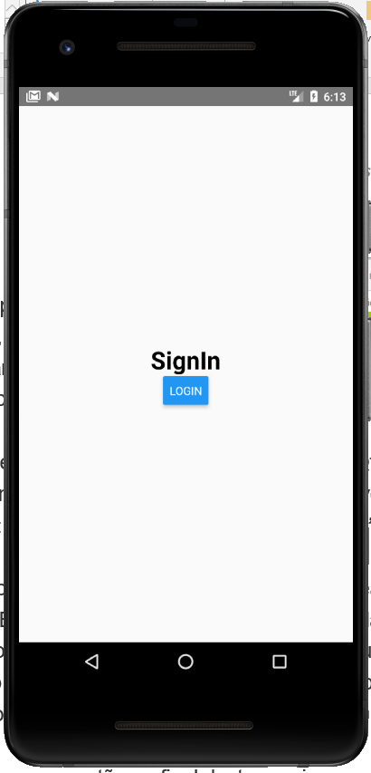

# Dev Finder

# ANDROID

por enquanto como estamos utilizando o react mais atual não precisa linkar as dependências e as libs que necessitam mudar o gradle já foram alteradas.

# IOS

precisa rodar o pod install dentro da pasta ios

`cd ios; pod install;`

estamos usando uma lib do react vector icons e precisa de algumas mudanças que são feitas pelo xcode nessa parte do artigo ele explica, e contém um link de de um artigo ensinando a colocar as fontes

[oblador/react-native-vector-icons](https://github.com/oblador/react-native-vector-icons#ios)

# Estrutura de pastas

    ├── src
    │   ├── Components      # Todo componente que puder ficar isolado ficrá aqui.
    │   ├── Config          # configuração (reactotron entre outros) - não impacta na aplicação
    │   ├── Pages           # As páginas da aplicação
    │   ├── Routes          # as rotas da aplicação
    │   └── Services        # configuração de api ex: gitHub.js, api.js (podem ter várias)
    │   └── Styles          # estilos de textos, cores e tamanhos
    └── index.js            # entrada do app

# Partindo do login

- a primeira tela da aplicação



## Código

- src\index.js ⇒ existe uma lógica para tratar a exibição das rotas ou da página de login:

   ```
    import React from 'react';
    import Routes from './Routes';
    import 'react-native-gesture-handler';
    import SignIn from './Pages/SignIn';

    export default function App() {
      const [log, setLog] = React.useState(false);
      const login = () => setLog(!log);
      return log ? <Routes /> : <SignIn login={login} />;
    }
    ```

- `log` é o estado por padrão é false, isso significa que ele está desconectado,e passado pra tela de login **SignIn** uma função que pertence ao app.js essa função faz a mudança do estado mudando assin a tela e caso quisermos desconectar é só passar pra routes e da routes pra página de SignOut.

# Routes

foi ultilizado o react navigation 5.x, mas especificamente o :

[React Navigation](https://reactnavigation.org/docs/bottom-tab-navigator/)

 **BottomTabNavigator**

que já facilita pra gente algumas coisas nesse link existe toda explicação de como usar então não entrar muito em detalhes


## Navegar de fora da stack

[React Navigation](https://reactnavigation.org/docs/navigating-without-navigation-prop/)

# Json server

- rodar o comando na raiz do projeto

`yarn json-server server.json -p 3333 --host seuip -w`

- configurar o ip na api src\Services\Api.js
- o arquivo onde estão os dados é o `server.json` que está na raiz do projeto
- a api do git retorna as informações assim [https://api.github.com/search/users?q=location:são+paulo](https://api.github.com/search/users?q=location:s%C3%A3o+paulo)

# ReactoTron

- está configurado essa ferramenta permite ver estado e ver console.log de dentro do native .
- se estiver debugando via usb tem que colocar o ip no arquivo src\Config\Reactotron.js

[infinitered/reactotron](https://github.com/infinitered/reactotron)

- é preciso instalar a ferramenta caso queira ter mais controle do que está acontecendo no rn

Por enquanto é isso.
